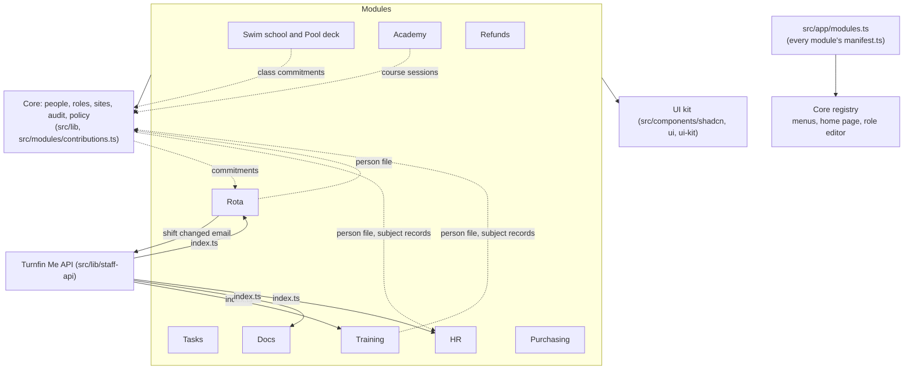

# Turnfin architecture

Turnfin is a modular monolith: one Next.js app and one main database, in layers. The rules are in [CLAUDE.md](../../CLAUDE.md); progress is in [MIGRATION.md](MIGRATION.md); the audit is in [audit.md](audit.md). The current import and data rules are also described in [../architecture.md](../architecture.md).

## Layers today

| Layer | Folder today | Target folder |
| --- | --- | --- |
| Platform (Core) | `src/lib`, `src/auth.ts`, `src/modules/{registry,contributions,context}.ts`, `src/platform/events` | `src/platform` |
| UI kit | `src/components/{shadcn,ui,ui-kit}`, `form-dialog`, `confirm-action`, `searchable-picker`, the theme in `src/app/theme` | `src/ui` (see ADR 0003) |
| Modules | `src/modules/<id>/{index.ts,manifest.ts,module.ts,events.ts,README.md,shared,features}` | same |
| Front | `src/components/{home,core,workspace}`, `src/lib/home.ts`, `src/lib/staff-api` (Turnfin Me's API) | `src/front` |
| Platform admin screens | `src/components/{people,staff,clubs,devices,setup,help}`, `src/app/(core)` | stays with the platform (ADR 0001) |
| Module list | `src/app/modules.ts`: every module's `manifest.ts` (name, menu entry, levels, permissions), read by Core's registry | same |
| Module wiring | `src/modules/server.ts` loads each `module.ts` plug; `src/modules/session-hooks.ts` | same (ADR 0006) |
| Routes | `src/app` | `src/app` |

## Module map (approved 9 October 2026)

| Module | Purpose | Tables (`prisma/schema/<file>`) | Talks to others through |
| --- | --- | --- | --- |
| activities | Runs the swim school: classes, swimmers, attendance, assessments, the parent app and the pool deck. | `activities.prisma` | reports class commitments; site summaries; home cards |
| refunds | Moves a refund request from reception to finance. Features: `queue`, `request`, `workspace` ([README](../../src/modules/refunds/README.md)). | `refunds.prisma` | home cards |
| purchasing | Raises and approves purchase orders. Features: `orders`, `suppliers`, `workspace` ([README](../../src/modules/purchasing/README.md)). | `purchasing.prisma` | home cards |
| academy | Runs the lifeguard and swim teacher courses we deliver. Features: `courses`, `course-types`, `calls`, `booking`, `workspace` ([README](../../src/modules/academy/README.md)). | `academy.prisma` | home cards; its own public API |
| tasks | Runs each site's daily checks and logs. Features: `day`, `follow-ups`, `templates`, `sites`, `reports`, `schedule`, `workspace` ([README](../../src/modules/tasks/README.md)). | `tasks.prisma` | home cards |
| training | Assigns courses and records completions. Features: `courses`, `assignments`, `sign-off`, `certificates`, `expiring`, `me`, `person-file`, `workspace` ([README](../../src/modules/training/README.md)). | `training.prisma` | personal file, subject records, Turnfin Me digest |
| docs | Publishes documents and required reading. Features: `home`, `library`, `reader`, `editor`, `history`, `work`, `reports`, `admin`, `files`, `import`, `me`, `workspace` ([README](../../src/modules/docs/README.md)). | own database (`DOCS_DATABASE_URL`) | home cards, Turnfin Me digest |
| hr | Keeps staff files, notes and reviews. Features: `team`, `person`, `reviews`, `activity`, `export`, `details-requests`, `me`, `workspace` ([README](../../src/modules/hr/README.md)). | own database (`HR_DATABASE_URL`) | reads the personal file and subject records |
| rota | Plans who works when. Features: `plan`, `today`, `bookings`, `absences`, `me`, `person-file`, `workspace` ([README](../../src/modules/rota/README.md)). | `rota.prisma` | reads commitments; shift-change emails; personal file |

Platform owns `core.prisma` and `base.prisma`: people, roles, sites, departments, qualifications, devices, the audit log.

Modules read those tables only through Core's functions, never with their own queries or relation joins (Phase 3; the boundary lint enforces it for every module):
- `src/lib/directory.ts`: people, sites, roles, departments and positions;
- `src/lib/qualifications.ts`: qualification types, what people hold, uploaded certificates, and recording or withdrawing a qualification;
- `src/lib/setup/activity-types.ts`: the activity list the rota plans;
- `src/lib/people/records.ts`: staff details, for HR;
- `src/lib/audit.ts`: writing the audit log, and a module's own audit trail;
- `src/lib/policy`: who may do what, and over whom.

No module imports another; the boundary lint makes it an error. Solid arrows are direct calls through a module's `index.ts` (or Core's notifier). Dashed arrows are registrations: a module registers a home card, commitments, a person-file section or subject records in `src/modules/contributions.ts` from its `module.ts`, and another module or Core screen reads whatever is registered. Every module also registers a home card. No events are emitted yet ([events.md](events.md)).
