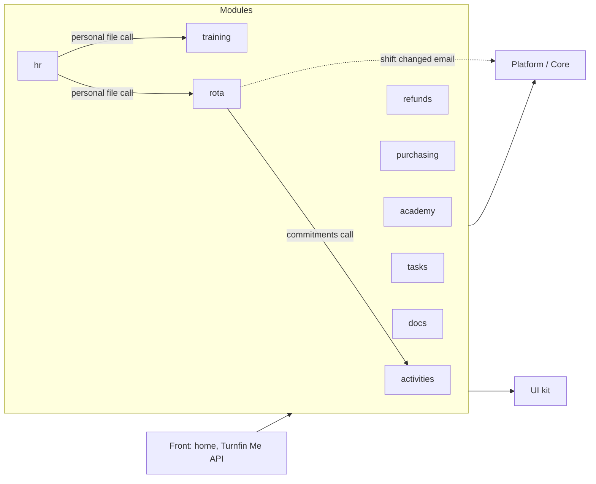

# Turnfin architecture

Turnfin is a modular monolith: one Next.js app and one main database, in layers. The rules are in [CLAUDE.md](../../CLAUDE.md); progress is in [MIGRATION.md](MIGRATION.md); the audit is in [audit.md](audit.md). The current import and data rules are also described in [../architecture.md](../architecture.md).

## Layers today

| Layer | Folder today | Target folder |
| --- | --- | --- |
| Platform (Core) | `src/lib`, `src/auth.ts`, `src/modules/{registry,contributions,context}.ts`, `src/platform/events` | `src/platform` |
| UI kit | `src/components/{shadcn,ui,ui-kit}`, `form-dialog`, `confirm-action`, `searchable-picker`, the theme in `src/app/theme` | `src/ui` (see ADR 0003) |
| Modules | `src/modules/<id>/{lib,components}` | `src/modules/<id>/{index.ts,module.ts,events.ts,README.md,shared,features}` |
| Front | `src/components/{home,core,workspace}`, `src/lib/home.ts`, `src/lib/staff-api` (Turnfin Me's API) | `src/front` |
| Platform admin screens | `src/components/{people,staff,clubs,devices,setup,help}`, `src/app/(core)` | stays with the platform (ADR 0001) |
| Module wiring | `src/modules/server.ts`, `src/modules/session-hooks.ts` | `src/app/modules.ts` |
| Routes | `src/app` | `src/app` |

## Module map (approved 9 October 2026)

| Module | Purpose | Tables (`prisma/schema/<file>`) | Talks to others through |
| --- | --- | --- | --- |
| activities | Runs the swim school: classes, swimmers, attendance, assessments, the parent app and the pool deck. | `activities.prisma` | reports class commitments; site summaries; home cards |
| refunds | Moves a refund request from reception to finance. Features: `queue`, `request`, `workspace` ([README](../../src/modules/refunds/README.md)). | `refunds.prisma` | home cards |
| purchasing | Raises and approves purchase orders. Features: `orders`, `suppliers`, `workspace` ([README](../../src/modules/purchasing/README.md)). | `purchasing.prisma` | home cards |
| academy | Runs the lifeguard and swim teacher courses we deliver. Features: `courses`, `course-types`, `calls`, `booking`, `workspace` ([README](../../src/modules/academy/README.md)). | `academy.prisma` | home cards; its own public API |
| tasks | Runs each site's daily checks and logs. | `tasks.prisma` | home cards |
| training | Assigns courses and records completions. | `training.prisma` | personal file, subject records, Turnfin Me digest |
| docs | Publishes documents and required reading. | own database (`DOCS_DATABASE_URL`) | home cards, Turnfin Me digest |
| hr | Keeps staff files, notes and reviews. | own database (`HR_DATABASE_URL`) | reads the personal file and subject records |
| rota | Plans who works when. | `rota.prisma` | reads commitments; shift-change emails; personal file |

Platform owns `core.prisma` and `base.prisma`: people, roles, sites, departments, qualifications, devices, the audit log.

Solid arrows are direct calls, dashed are events (or event candidates). Today the calls go through `src/modules/contributions.ts`, not through each module's `index.ts`.
